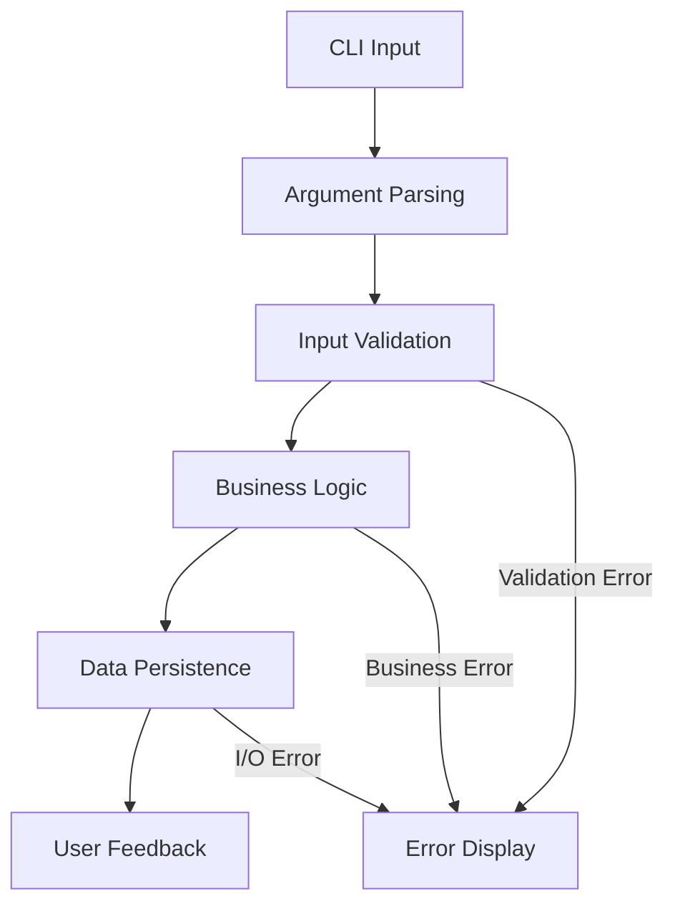
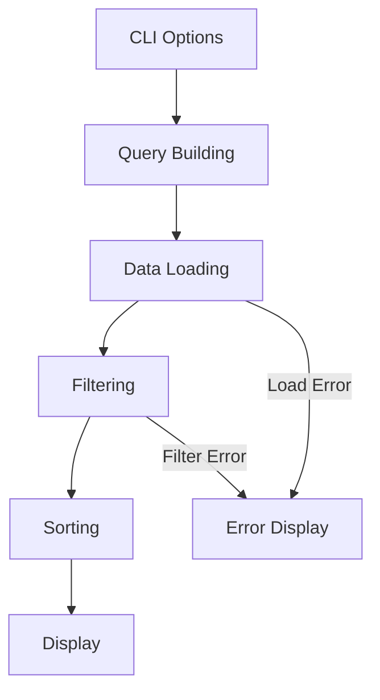

# Architecture Documentation

## Overview

The Rust Todo CLI follows a **clean architecture** pattern with clear separation of concerns. This document explains the design decisions, patterns used, and how the components interact.

## System Architecture

### High-Level Architecture

```
┌─────────────────────────────────────────────────────────────┐
│                    CLI Layer                                │
│  ┌─────────────┐  ┌─────────────┐  ┌─────────────────────┐  │
│  │  commands.rs│  │ handlers.rs │  │     main.rs         │  │
│  │             │  │             │  │                     │  │
│  │ • Clap      │  │ • Command   │  │ • Entry Point       │  │
│  │ • Args      │  │   Execution │  │ • Error Handling    │  │
│  │ • Validation│  │ • Flow      │  │ • Process Exit      │  │
│  └─────────────┘  └─────────────┘  └─────────────────────┘  │
└─────────────────────────────────────────────────────────────┘
                               │
                               ▼
┌─────────────────────────────────────────────────────────────┐
│                   Domain Layer                              │
│  ┌─────────────┐  ┌─────────────┐  ┌─────────────────────┐  │
│  │   item.rs   │  │  manager.rs │  │     error.rs        │  │
│  │             │  │             │  │                     │  │
│  │ • TodoItem  │  │ • Business  │  │ • Error Types       │  │
│  │ • Priority  │  │   Logic     │  │ • Error Context     │  │
│  │ • SortBy    │  │ • CRUD Ops  │  │ • User Messages     │  │
│  └─────────────┘  └─────────────┘  └─────────────────────┘  │
└─────────────────────────────────────────────────────────────┘
                               │
                               ▼
┌─────────────────────────────────────────────────────────────┐
│               Infrastructure Layer                          │
│  ┌─────────────┐  ┌─────────────┐  ┌─────────────────────┐  │
│  │  display/   │  │   utils/    │  │   Persistence       │  │
│  │             │  │             │  │                     │  │
│  │ • Formatter │  │ • Validation│  │ • JSON Storage      │  │
│  │ • Table     │  │ • Date Parse│  │ • File Operations   │  │
│  │ • Display   │  │ • Utilities │  │ • Serialization     │  │
│  └─────────────┘  └─────────────┘  └─────────────────────┘  │
└─────────────────────────────────────────────────────────────┘
```

### Layer Responsibilities

#### CLI Layer
- **Input Parsing**: Command-line arguments and options
- **Command Routing**: Dispatch to appropriate handlers
- **Output Formatting**: User-friendly display of results
- **Error Presentation**: Converting technical errors to user messages

#### Domain Layer
- **Business Logic**: Core todo management operations
- **Data Models**: Todo items, priorities, sorting criteria
- **Validation Rules**: Business rule enforcement
- **Error Definitions**: Domain-specific error types

#### Infrastructure Layer
- **Data Persistence**: File I/O and serialization
- **Utilities**: Date parsing, validation, formatting
- **External Services**: Future database or API integrations

## Design Patterns

### 1. Command Pattern

The CLI uses the command pattern for extensible command handling:

```rust
#[derive(Subcommand)]
pub enum Commands {
    Add { title: String, /* ... */ },
    Edit { id: u32, /* ... */ },
    Delete { id: u32 },
    List { /* filtering options */ },
    Toggle { id: u32 },
    ClearList,
}

pub fn handle_commands(command: Commands, manager: &mut TodoManager) -> TodoResult<()> {
    match command {
        Commands::Add { title, .. } => manager.add_todo(title, ..),
        Commands::Edit { id, .. } => manager.edit_todo(id, ..),
        // ...
    }
}
```

**Benefits:**
- Easy to add new commands without modifying existing code
- Clear separation between command parsing and execution
- Testable command handlers with mock dependencies
- Consistent error handling across all commands

### 2. Repository Pattern

Data persistence is abstracted behind a repository-like interface:

```rust
impl TodoManager {
    pub fn load_todos(file_path: &str) -> TodoResult<Vec<TodoItem>> { /* */ }
    pub fn save(&self) -> TodoResult<()> { /* */ }

    // Business logic methods
    pub fn add_todo(&mut self, /* params */) -> TodoResult<()> { /* */ }
    pub fn find_todo_mut(&mut self, id: u32) -> TodoResult<&mut TodoItem> { /* */ }
}
```

**Benefits:**
- Abstracted storage layer allows easy testing with mock implementations
- Clear separation between business logic and persistence concerns
- Future database integration requires minimal changes to business logic
- Atomic operations ensure data consistency

### 3. Builder Pattern (Query Object)

The `ListQuery` struct acts as a flexible query builder:

```rust
pub struct ListQuery {
    pub sort_by: SortBy,
    pub asc: bool,
    pub desc: bool,
    pub only_complete: bool,
    pub only_pending: bool,
    pub priority: Option<Priority>,
    pub overdue: bool,
    pub due_today: bool,
    pub due_tomorrow: bool,
    pub due_within: Option<i64>,
}

impl ListQuery {
    pub fn item_passes_filters(&self, item: &TodoItem) -> bool {
        self.passes_status_filter(item)
            && self.passes_priority_filter(item)
            && self.passes_time_filter(item)
    }
}
```

**Benefits:**
- Composable filtering logic with clear boolean semantics
- Extensible query capabilities without breaking existing code
- Type-safe query construction with compile-time validation
- Efficient filtering with short-circuit evaluation

### 4. Type State Pattern

Enums like `Priority` and `SortBy` leverage Rust's type system:

```rust
#[derive(PartialOrd, Ord, Clone, Copy)]
pub enum Priority {
    Low,    // Automatically orders first
    Medium,
    High,   // Automatically orders last
}

#[derive(Clone, Copy)]
pub enum SortBy {
    Due,
    Priority,
    DueThenPriority,
}
```

**Benefits:**
- Compile-time validation of valid states
- Natural ordering through derive macros
- Zero-cost abstractions with enum optimization
- Exhaustive pattern matching prevents bugs

## Error Handling Strategy

### Philosophy

Our error handling follows Rust's best practices:

- **Explicit over Implicit**: All errors are explicitly handled with `Result<T, E>`
- **Context Rich**: Errors include relevant information for debugging and user guidance
- **User Friendly**: Error messages guide users toward solutions with actionable advice
- **Structured Data**: Errors include typed data for programmatic handling

### Error Hierarchy

```rust
#[derive(Error, Debug)]
pub enum TodoError {
    // Input validation errors
    InvalidDateFormat { input: String },
    InvalidPriority { input: String },
    EmptyTodo,
    TodoTooLong { actual: usize, max: usize },

    // Business logic errors
    TodoNotFound { id: u32 },
    InvalidId { id: String },

    // System errors
    FileError { operation: String, path: String, #[source] source: std::io::Error },
    SerializationError(#[from] serde_json::Error),
}
```

### Error Propagation Flow

```rust
pub fn add_todo(&mut self, title: String, ...) -> TodoResult<()> {
    let validated_title = validate_text(&title, 140)?;    // Input validation
    let parsed_date = parse_due_date(due_date)?;          // Business logic
    let todo = TodoItem::new(/* ... */);                  // Domain object creation
    self.todos.push(todo);                               // State mutation
    self.save()?;                                        // Persistence with I/O errors
    println!("✅ Todo added with ID: {}", next_id);      // User feedback
    Ok(())
}
```

**Error Recovery Strategies:**
- **Validation Errors**: Immediate feedback with correction guidance
- **Business Errors**: Contextual information with suggested actions
- **System Errors**: Graceful degradation with retry suggestions
- **Persistence Errors**: Data integrity protection with rollback capability

## Data Flow

### Add Todo Flow



1. **CLI Layer**: Parse arguments with `clap` derive macros
2. **Validation**: Validate input data (length, format, business rules)
3. **Business Logic**: Create `TodoItem` with validated, parsed data
4. **Persistence**: Atomic save to JSON file with error handling
5. **Feedback**: Display success message or detailed error information

### List/Filter Flow



1. **CLI Layer**: Parse filter and sort options into structured query
2. **Query Building**: Construct `ListQuery` with boolean filter logic
3. **Data Retrieval**: Load todos from persistent storage
4. **Filtering**: Apply filters using iterator chains with short-circuit evaluation
5. **Sorting**: Sort by specified criteria with stable sort guarantees
6. **Display**: Format and present results with consistent table formatting

## Performance Considerations

### Time Complexity Analysis

| Operation | Best Case | Average Case | Worst Case | Notes |
|-----------|-----------|--------------|------------|--------|
| Add Todo | O(1) | O(1) | O(1) | Constant time insertion |
| Delete Todo | O(n) | O(n) | O(n) | Linear search for ID |
| Find by ID | O(1) | O(n) | O(n) | Could optimize with HashMap |
| Filter | O(n) | O(n) | O(n) | Single pass through items |
| Sort | O(n) | O(n log n) | O(n log n) | Comparison-based sorting |
| Save/Load | O(n) | O(n) | O(n) | JSON serialization |

### Memory Usage Patterns

- **In-Memory Storage**: All todos loaded into memory for fast access
- **String Handling**: Efficient `String` operations with minimal cloning
- **Serialization**: Streaming JSON for large datasets (future optimization)
- **Iterator Chains**: Zero-cost abstractions for data processing

### Optimization Opportunities

#### Phase 1 (Current)
- ✅ Efficient string handling with `&str` where possible
- ✅ Iterator chains instead of explicit loops
- ✅ Zero-cost enum optimizations

#### Phase 2 (Planned)
- [ ] **Indexed Lookups**: `HashMap<u32, usize>` for O(1) ID-based operations
- [ ] **Lazy Loading**: Load todos on-demand for large files
- [ ] **Caching**: Cache sorted/filtered results for repeated queries
- [ ] **Incremental Saves**: Only persist changed data to reduce I/O

#### Phase 3 (Future)
- [ ] **Database Backend**: SQLite for better query performance
- [ ] **Streaming JSON**: For handling very large todo collections
- [ ] **Memory Pools**: Custom allocators for frequent operations
- [ ] **Parallel Processing**: Multi-threaded filtering and sorting

## Testing Strategy

### Test Pyramid

```
    ┌─────────────────┐
    │  Integration    │  ← Full CLI workflows (8+ tests)
    │     Tests       │
    ├─────────────────┤
    │   Unit Tests    │  ← Individual functions (45+ tests)
    │                 │
    ├─────────────────┤
    │  Property Tests │  ← Edge cases and invariants
    └─────────────────┘
```

### Testing Patterns

#### Dependency Injection for Testing
```rust
// Production
impl TodoManager {
    pub fn new(file_path: String) -> TodoResult<Self> {
        let todos = Self::load_todos(&file_path)?;
        // ...
    }
}

// Testing
#[cfg(test)]
fn create_test_manager() -> TodoManager {
    let temp_file = NamedTempFile::new().unwrap();
    let file_path = temp_file.path().to_string_lossy().into_owned();
    TodoManager::new(file_path).unwrap()
}
```

#### Error Scenario Testing
```rust
#[test]
fn test_add_todo_validation_error() {
    let mut manager = create_test_manager();
    let long_title = "a".repeat(200); // Exceeds 140 char limit

    let result = manager.add_todo(long_title, None, None, None, None);

    assert!(matches!(result.unwrap_err(), TodoError::TodoTooLong { .. }));
}
```

#### Property-Based Testing
```rust
use proptest::prelude::*;

proptest! {
    #[test]
    fn test_validate_text_length_property(input in ".*", max_len in 1..1000usize) {
        let result = validate_text(&input, max_len);
        if input.trim().len() <= max_len && !input.trim().is_empty() {
            assert!(result.is_ok());
        }
    }
}
```

### Test Organization

```
tests/
├── integration_tests.rs    # End-to-end CLI testing
├── manager_tests.rs        # TodoManager integration tests  
├── date_parsing_tests.rs   # Complex date parsing scenarios
└── common/
    └── mod.rs             # Shared test utilities
```

## Security Considerations

### Input Validation
- **Length Limits**: Prevent memory exhaustion with bounded input sizes
- **Format Validation**: Strict parsing of dates, priorities, and IDs
- **Path Traversal**: Sanitize file paths to prevent directory traversal
- **Injection Prevention**: No dynamic code execution or SQL injection risks

### File System Security
- **Atomic Operations**: Use temporary files with atomic rename for consistency
- **Permission Handling**: Respect file system permissions and ownership
- **Error Information**: Avoid leaking sensitive path information in error messages

### Dependency Security
- **Regular Auditing**: Use `cargo audit` in CI pipeline
- **Minimal Dependencies**: Only include necessary, well-maintained crates
- **Version Pinning**: Lock dependency versions to prevent supply chain attacks

## Deployment Architecture

### Single Binary Distribution
- **Self-Contained**: No external runtime dependencies
- **Cross-Platform**: Native compilation for Linux, macOS, Windows
- **Small Footprint**: ~2MB optimized binary with LTO and strip
- **Static Linking**: No shared library dependencies

### Configuration Management
```rust
pub mod config {
    pub const DEFAULT_FILE: &str = "todo_list.json";
    pub const MAX_TITLE_LENGTH: usize = 140;
    pub const MAX_DESCRIPTION_LENGTH: usize = 1000;
}
```

**Configuration Sources (Priority Order):**
1. Command-line arguments (`--file custom.json`)
2. Environment variables (`TODO_FILE=custom.json`)
3. Configuration file (`~/.todo/config.toml`)
4. Built-in defaults

## Future Architecture Evolution

### Planned Extensions

#### Database Backend (v0.2.0)
```rust
trait TodoRepository {
    fn save(&self, todos: &[TodoItem]) -> TodoResult<()>;
    fn load(&self) -> TodoResult<Vec<TodoItem>>;
    fn find_by_id(&self, id: u32) -> TodoResult<Option<TodoItem>>;
}

struct JsonRepository { file_path: String }
struct SqliteRepository { connection: Connection }
```

#### Web API (v0.3.0)
```rust
// RESTful API endpoints
GET    /api/todos           # List todos with filtering
POST   /api/todos           # Create new todo
GET    /api/todos/{id}      # Get specific todo  
PUT    /api/todos/{id}      # Update todo
DELETE /api/todos/{id}      # Delete todo
```

#### Plugin System (v0.4.0)
```rust
trait TodoPlugin {
    fn name(&self) -> &str;
    fn handle_command(&self, args: &[String]) -> TodoResult<()>;
    fn register_commands(&self) -> Vec<CommandDefinition>;
}
```

### Architecture Principles for Evolution

1. **Backward Compatibility**: New features don't break existing functionality
2. **Interface Stability**: Public APIs remain stable across minor versions
3. **Extensibility**: Plugin architecture allows community contributions
4. **Performance**: New features maintain or improve performance characteristics
5. **Security**: Enhanced features don't compromise security posture

---

## Conclusion

This architecture balances **simplicity with extensibility**, **performance with maintainability**, and **type safety with ergonomics**. The clean separation of concerns makes the codebase approachable for new contributors while providing a solid foundation for future enhancements.

The use of Rust's type system, combined with established patterns like Command and Repository, creates a robust and maintainable codebase that demonstrates professional software engineering practices.
